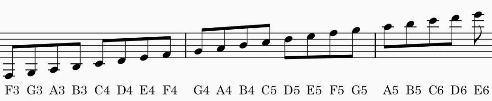
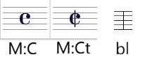

# Instrukcja labelowania (OMR)

Ten dokument opisuje, jak wpisywać labele w narzędziu do labelowania.

## Tabela zasad

| Kategoria | Format labela | Dozwolone wartości / skróty | Przykład | Znaczenie |
|---|---|---|---|---|
| Wysokość dźwięku | `[litera][oktawa]` | Litera: `A B C D E F G`, oktawa jako liczba | `C4`, `A3`, `G4` | Nazwa nuty i oktawa (klucz wiolinowy, C4 = środkowe C) |
| Krzyżyk | `sh` | `sh` = ♯ | `sh` | krzyżyk |
| Bemol | `bm` | `bm` = ♭ | `bm` | bemol |
| Kasownik | `n` | `n` = ♮ | `n` | kasownik |
| Długość nuty | `[wysokość]/[długość]` | `1`, `2`, `4`, `8`, `16` | `4/C4` | Nuta z długością rytmiczną |
| Kropka rytmiczna | `.` lub `..` | `.` = 1 kropka, `..` = 2 kropki | `.` | Wydłużenie wartości nuty |
| Pauza | `r[długość]` | Te same długości co nuty | `R4`, `R1` | Pauza o danej wartości |
| Metrum | `M:x/y` | np. `4/4`, `3/4`, `6/8` | `M:4/4` | Oznaczenie metrum |
| Klucz | `K:t` lub `K:b` | `t` = treble, `b` = bass  | `K:t` | Klucz wiolinowy, basowy itd.|

## Mapowanie długości

| Wartość rytmiczna | Label |
|---|---|
| Cała nuta | `1` |
| Półnuta | `2` |
| Ćwierćnuta | `4` |
| Ósemka | `8` |
| Szesnastka | `16` |

## Przykłady gotowych etykiet

- Ćwierćnuta C: `4` i `C4`
- Cała nuta A: `1` i `A3`
- Ósemka G: `8` i `G4`
- Pauza ćwierćnutowa: `R4` i `-` 
- Metrum: `M:4/4` i `-`
- Klucz: `K:t` i `-`

## Graficzne przedstawienie wysokości nut

## Oznaczenia dla Common time, Cut time i Bar line

*używanie wielkich czy małych liter nie powinno robić różnicy